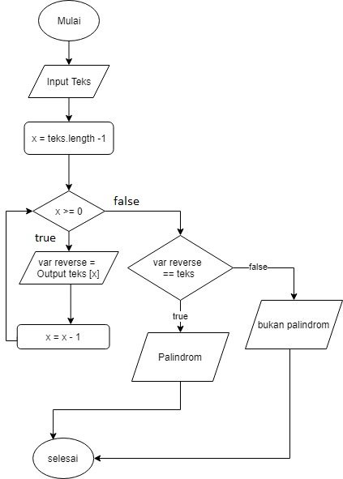

# Algoritma dan Flowchart Soal 1

```
Deteksi Palindrom
Diberikan sebuah teks, periksa apakah kata tersebut adalah palindrom atau tidak.
Misalnya teks “Malam”, output = palindrom.
```

**Flowchart**



**Algoritma**

1. Mulai
2. Masukan teks "malam"
3. Proses pengecekan urutan angka dan jumlah keseluruhan kurangi 1
4. Masukan hasil ke variabel x
5. Cek apakah variabel tsb lebih besar sama dengan 0
6. Jika iya tampilkan urutan huruf berdasarkan nilai var x dan masukan dalam variabel penampung var reverse
7. Kurangi nilai var x dan kurangi 1
8. Setelah itu Proses mengulangi step nomor 5 
9. Jika Tidak, Cek apakah variabel reverse sama dengan inputan teks
10. Jika Iya, Tampilkan teks "Palindrom"
11. Jika Tidak, Tampilkan teks "Bukan Palindrom"
12. Selesai


**
