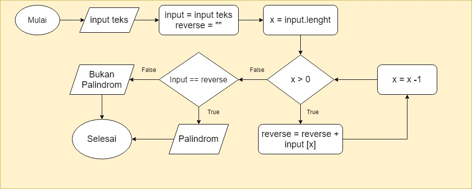

# Algoritma dan Soal Flowchart Soal 1

```
Deteksi Palindrom
Diberikan sebuah teks, periksa apakah kata tersebut adalah palindrom atau tidak.
Misalnya teks “Malam”, output = palindrom.
```

**Flowchart**



**Algoritma**

1. Mulai
2. Inputkan teks "malam"
3. Masukan teks tsb ke variabel input dan juga buat variable reverse
4. Hitung banyaknya karakter di teks tsb dan masukan ke variable x
5. cek nilai variable x apakah lebih besar dari 0
6. Jika **True** (Variable x lebih besar dari 0), Tampilkan karakter berdasarkan urutan nilai dari variable x dan masukan ke variable reverse
7. Setelah itu, Kurangi 1 nilai variable x
8. Ulangi step ke 5
9. Jika **False** (Variable x lebih kecil dari 0), cek nilai variable reverse sama atau tidak dengan variable input
10. Jika **True**, Tampilkan Teks *Palindorm*
11. Jika **False**, Tampilkan Teks *Bukan Palindorm*  
12. Selesai
    

