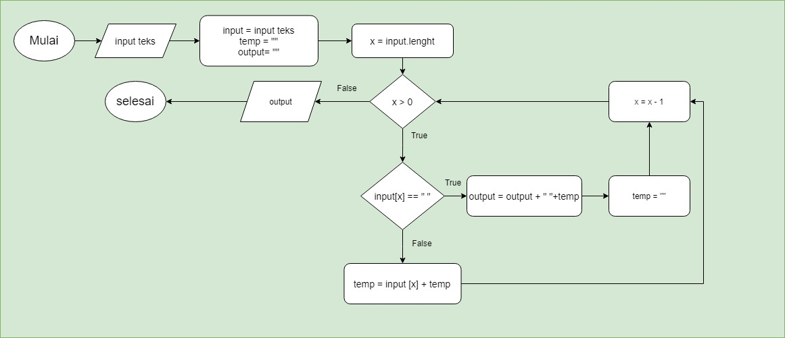

# Algoritma dan Soal Flowchart Soal 2

```
Reverse Words

Diberikan sebuah kalimat, ubah urutan kata-kata di dalam kalimat menjadi terbalik.
Misalnya kalimat “Saya belajar Javascript”, output “Javascript belajar Saya”

```

**Flowchart**



**Algoritma**

1. Mulai
2. Inputkan kalimat "Saya Belajar Javascript"
3. Masukan kalimat tsb ke variabel input, buat variable temp dan juga buat variable output
4. Hitung banyaknya karakter di kalimat tsb dan masukan ke variable x
5. cek nilai variable x apakah lebih besar dari 0
6. Jika **True** (nilai variable x lebih besar dari 0), cek apakah karakter tersebut merupakan karakter spasi
7. Jika Karakter tsb ***bukan (false)*** spasi Tampilkan karakter berdasarkan urutan nilai dari variable x dan masukan ke variable temp
8. Setelah itu kurangi 1 nilai variable x dan ulangi step ke 5
9. Jika Karakter tsb ***merupakan (true)*** spasi tampilkan nilai variable output, spasi, variable temp dan masukan ke variable output
10. Reset (kosongkan) nilai variable temp
11. Setelah itu kurangi 1 nilai variable x dan ulangi step ke 5
12. Jika **False** (nilai variable x lebih kecil dari 0), Tampilkan variable output
13. Selesai

